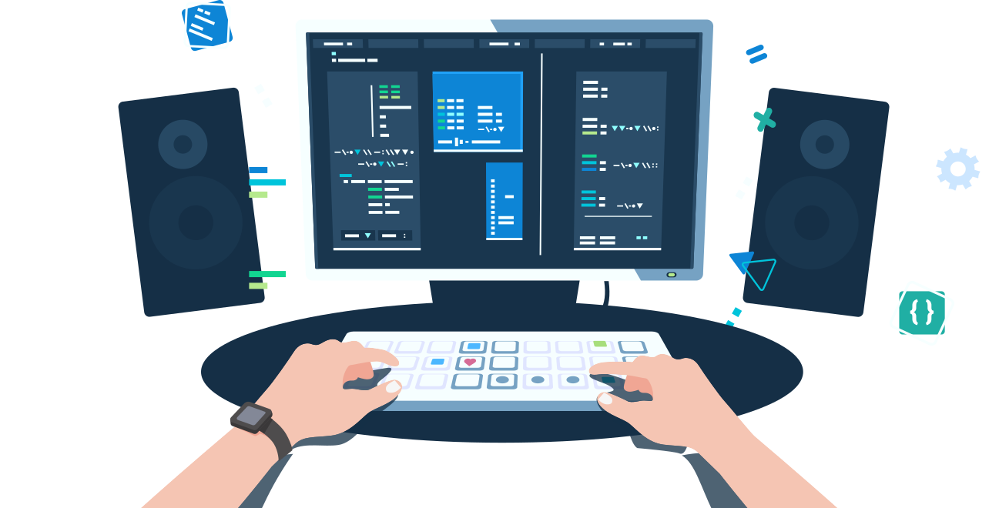

<!-- Header with animated wave and typing effect -->
<h1 align="center">
   
  Hi, I'm a Blockchain Developer!
</h1>
<div align="center">
  
</div>

<div align="center">
  
</div>

<!-- About Me Section -->
<h2 align="left">🚀 About Me</h2>

```bash
- 🔭 Currently building decentralized systems and blockchain infrastructure
- 🌱 Contributing to open-source blockchain projects
- ⚡ Specialized in smart contract development and protocol implementations
- 🎯 Focused on distributed systems architecture
```

<!-- Tech Stack -->
<h2 align="left">🛠️ Technologies & Tools</h2>

<p align="center">
  
  
  
  
  
  
  
</p>

<!-- GitHub Impact -->
<h2 align="left">🔥 Developer Impact</h2>

<div align="center">
  <!-- Project Creation & Contribution Metrics -->
  <picture>
    <source 
      srcset="https://github-profile-summary-cards.vercel.app/api/cards/profile-details?username=0xObsidian&theme=github_dark"
      media="(prefers-color-scheme: dark)"
    />
    <source
      srcset="https://github-profile-summary-cards.vercel.app/api/cards/profile-details?username=0xObsidian&theme=default"
      media="(prefers-color-scheme: light), (prefers-color-scheme: no-preference)"
    />
    
  </picture>
</div>

<br/>

<!-- Footer -->
<div align="center">
  
  
  <h3>Connect with me:</h3>
  <a href="https://twitter.com/YOUR_TWITTER" target="_blank">
    
  </a>
  <a href="https://discord.gg/YOUR_DISCORD" target="_blank">
    
  </a>
</div>

<!-- Cool SVG Wave -->


